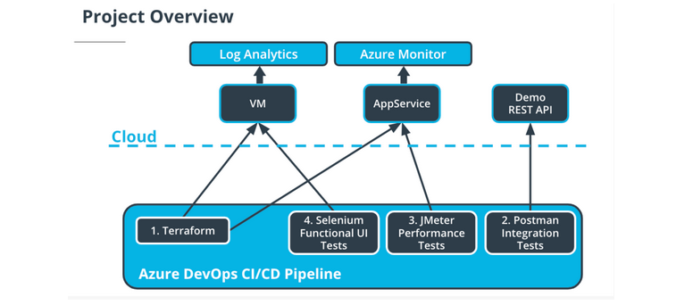
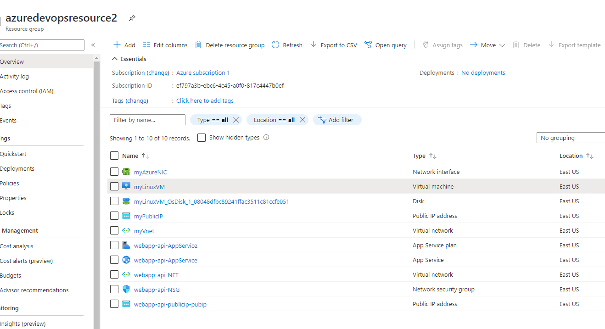
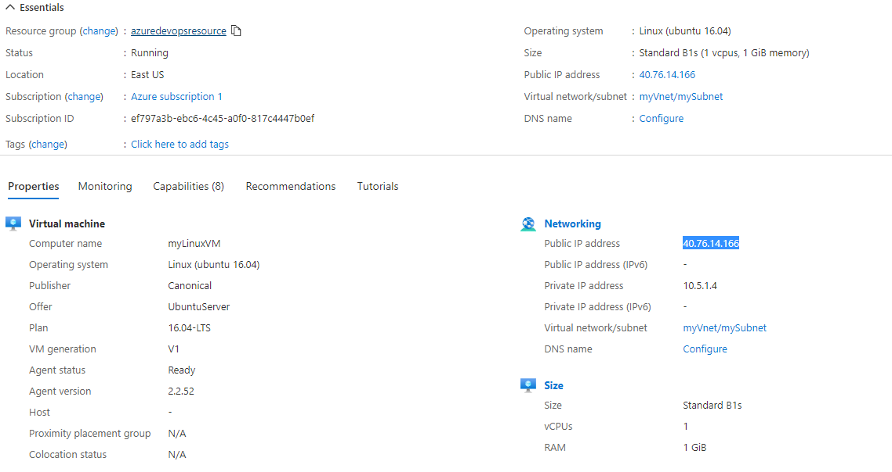
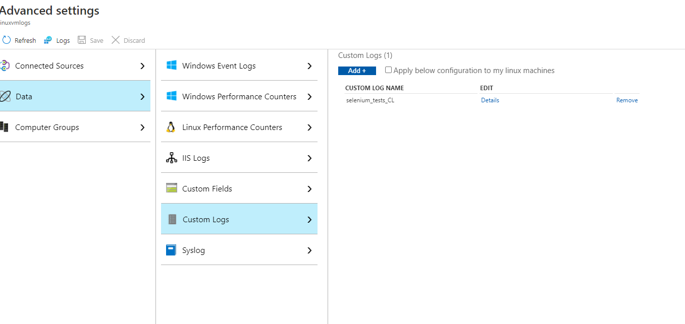

# Overview 

Project - CI/CD project covers the following.

	Iaas - Bring up the following using terraform 
	
	        1. Linux VM 
			2. App Service 
			3. Others supporting infrastructure (Network, Network security group, resource groups)
	
	
	Web App: Provided fakerestapi app deployed as package.
	        
			1. created zip file from the provided folder 
			2. Deploy into the AppService from package
	
	
	Seleinum tests: Automate UI tests using selenium 
	
	        Website url: https://www.saucedemo.com/
			
			1. Login 
			2. Add all items to cart
			3. Remove all items from cart
	
	Postman tests: Automate rest api calls 
			
			Website url: http://dummy.restapiexample.com
			
			1. GET request
			2. POST request
	
	JMeter tests: Performance tests 
	
			Website url: (app service) webapp-api-appservice.azurewebsites.net
			
			1. Endurance tests 
			2. Stress tests 

			10 users, covering 48 tests 
	
	terraform: deploy the infrastructure
	
			1. Create backend storage and resource group   
			2. Create resource group for deployment 
			3. Create Linux VM, App Service, network, nsg
			4. Linux VM:
				1. Copy rsa keys 
				2. Able to ssh to azure VM using from local machine 
				3. register agent script with PAT
			
	
Architecture of the project:

Instrcutions to run:

	Terraform deploy

		Using Azure release pipeline, deploy the terraform.
			
			1. update inputs in terraform/environments/test/terraform.tfvars
			2. Run release pipeline.

		

			It shall create app services in azure

		

		
		
		
		
		Also updates the envionment in azure pipelines with myLinuxVM
		
		
		
		
	
	Azure Pipeline: azure-pipelines-4.yaml
	
		Build:
			1. run postman tests and updates the tests Runs
			
		
		
			2. Double click one of the tests runs
			
		
		
		
		Deploy:
		
			1. deploy the webapp into app service 
			
		
		
			2. run Jmeter integration tests 
			
		
		
			3. run Seleinum tests on linux VM 
		
		
		
	
	Others:
	
		Jmeter Performance tests:
		
		
		
		Log analytics
		
		
		
		
		
	
			

